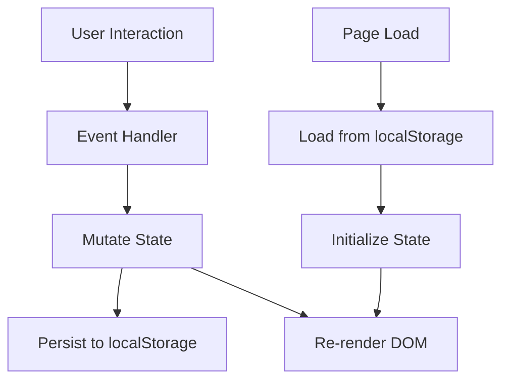

# Design Document: To-Do List Life Dashboard

## Overview

The To-Do List Life Dashboard is a single-page, client-side web application built with plain HTML, CSS, and Vanilla JavaScript. It serves as a personal productivity homepage featuring a real-time clock with contextual greeting, a configurable focus timer, a task management list, quick-access website links, and a dark/light theme toggle. All user data is persisted via the browser's `localStorage` API — no backend, no build toolchain, no network requests after initial load.

The application is intentionally minimal in its technology stack to maximize portability and load speed. The entire app ships as a single HTML file referencing one CSS file and one JavaScript file.

---

## Architecture

The application follows a **module-based Vanilla JS architecture** with a single source of truth in `localStorage`. There is no virtual DOM, no reactive framework, and no state management library. Instead, the app uses a simple pattern:

1. **State object** — an in-memory JS object holding all runtime state (tasks, links, timer config, theme).
2. **Render functions** — pure-ish functions that read from state and update the DOM.
3. **Event handlers** — functions that mutate state and call the appropriate render functions.
4. **Persistence layer** — a thin wrapper around `localStorage` that serializes/deserializes state.



### File Structure

```
/
├── index.html
├── css/
│   └── styles.css
└── js/
    └── app.js
```

All application logic lives in `js/app.js`. All styling lives in `css/styles.css`.

---

## Components and Interfaces

### 1. Clock & Greeting Component

Responsible for displaying the current time, date, and a time-sensitive greeting.

**Interface:**
- `initClock()` — starts a `setInterval` that fires every 1000ms
- `renderClock(now: Date)` — updates the DOM with formatted time, date, and greeting
- `getGreeting(hour: number): string` — pure function returning the appropriate greeting string

**DOM targets:** `#clock-time`, `#clock-date`, `#clock-greeting`

---

### 2. Focus Timer Component

A configurable countdown timer with start, stop, and reset controls.

**Interface:**
- `initTimer()` — loads persisted duration from localStorage, renders initial state
- `startTimer()` — begins the countdown interval
- `stopTimer()` — clears the interval, retains remaining time
- `resetTimer()` — restores remaining time to configured duration
- `tickTimer()` — decrements remaining seconds by 1, checks for completion
- `onTimerComplete()` — plays audio alert, shows visual notification
- `renderTimer(state: TimerState)` — updates MM:SS display and control states
- `setDuration(minutes: number)` — validates and sets configured duration (1–60 min)

**DOM targets:** `#timer-display`, `#timer-start`, `#timer-stop`, `#timer-reset`, `#timer-increase`, `#timer-decrease`

---

### 3. To-Do List Component

Full CRUD task management with sorting and persistence.

**Interface:**
- `initTasks()` — loads tasks from localStorage, renders list
- `addTask(title: string): Result` — validates, creates, persists, and renders a new task
- `deleteTask(id: string)` — removes task by ID, persists, re-renders
- `toggleTask(id: string)` — flips completion state, persists, re-renders
- `editTask(id: string, newTitle: string): Result` — validates new title, updates, persists, re-renders
- `sortTasks(mode: 'name' | 'status')` — returns sorted view without mutating stored order
- `renderTasks(tasks: Task[])` — rebuilds the task list DOM

**DOM targets:** `#task-input`, `#task-add-btn`, `#task-list`, `#task-sort-name`, `#task-sort-status`, `#task-error`

---

### 4. Quick Links Component

Manages user-defined URL shortcuts.

**Interface:**
- `initLinks()` — loads links from localStorage, renders panel
- `addLink(label: string, url: string): Result` — validates, creates, persists, renders
- `deleteLink(id: string)` — removes link, persists, re-renders
- `renderLinks(links: QuickLink[])` — rebuilds the links panel DOM

**DOM targets:** `#link-label-input`, `#link-url-input`, `#link-add-btn`, `#links-panel`, `#link-error`

---

### 5. Theme Toggle Component

Manages light/dark mode switching and persistence.

**Interface:**
- `initTheme()` — reads persisted preference, applies theme before first paint
- `toggleTheme()` — flips current theme, persists, applies to DOM
- `applyTheme(theme: 'light' | 'dark')` — adds/removes `data-theme="dark"` on `<html>`

**DOM targets:** `#theme-toggle`, `html[data-theme]`

---

### 6. Persistence Layer

A thin wrapper around `localStorage` with namespaced keys and error handling.

**Interface:**
- `save(key: StorageKey, value: unknown): void` — serializes to JSON and writes
- `load<T>(key: StorageKey, fallback: T): T` — reads and deserializes; returns fallback on error
- `StorageKey` enum: `TASKS`, `LINKS`, `TIMER_DURATION`, `THEME`

---

## Data Models

### Task

```typescript
interface Task {
  id: string;          // UUID or timestamp-based unique ID
  title: string;       // Non-empty, trimmed task title
  completed: boolean;  // Completion state
  createdAt: number;   // Unix timestamp for stable default ordering
}
```

### QuickLink

```typescript
interface QuickLink {
  id: string;   // UUID or timestamp-based unique ID
  label: string; // Non-empty display label
  url: string;   // Must start with "http://" or "https://"
}
```

### TimerState

```typescript
interface TimerState {
  configuredMinutes: number; // 1–60, persisted
  remainingSeconds: number;  // Runtime only, not persisted
  isRunning: boolean;        // Runtime only, not persisted
}
```

### AppTheme

```typescript
type AppTheme = 'light' | 'dark';
```

### StorageSchema

```typescript
interface StorageSchema {
  'tld:tasks': Task[];
  'tld:links': QuickLink[];
  'tld:timer': number;       // configuredMinutes only
  'tld:theme': AppTheme;
}
```

All keys are namespaced with the `tld:` prefix to avoid collisions with other apps sharing the same origin.

---

## Correctness Properties

*A property is a characteristic or behavior that should hold true across all valid executions of a system — essentially, a formal statement about what the system should do. Properties serve as the bridge between human-readable specifications and machine-verifiable correctness guarantees.*

### Property 1: Time formatting produces valid HH:MM:SS strings

*For any* `Date` object, the time-formatting function SHALL return a string matching the pattern `HH:MM:SS` where HH is in [00–23], MM is in [00–59], and SS is in [00–59].

**Validates: Requirements 1.1**

---

### Property 2: Greeting is correct for every hour of the day

*For any* integer hour in [0, 23], `getGreeting(hour)` SHALL return exactly one of "Good Morning", "Good Afternoon", "Good Evening", or "Good Night", and the returned value SHALL match the range the hour falls in (05–11 → Morning, 12–17 → Afternoon, 18–20 → Evening, 21–04 → Night).

**Validates: Requirements 1.3, 1.4, 1.5, 1.6**

---

### Property 3: Timer display always produces valid MM:SS strings

*For any* integer `remainingSeconds` in [0, 3600], the timer-formatting function SHALL return a string matching the pattern `MM:SS` where MM is in [00–60] and SS is in [00–59].

**Validates: Requirements 2.9**

---

### Property 4: Timer reset restores configured duration

*For any* configured duration in [1, 60] minutes, after starting the timer and ticking an arbitrary number of times, calling reset SHALL restore `remainingSeconds` to exactly `configuredMinutes × 60`.

**Validates: Requirements 2.4**

---

### Property 5: Duration adjustment respects bounds

*For any* configured duration in [1, 60], increasing the duration SHALL yield `min(duration + 1, 60)` and decreasing SHALL yield `max(duration - 1, 1)`.

**Validates: Requirements 2.6, 2.7**

---

### Property 6: Adding a valid task persists it and grows the list

*For any* non-empty, non-duplicate task title, calling `addTask` SHALL increase the task list length by exactly one and the new task SHALL be retrievable from `localStorage` under the `tld:tasks` key.

**Validates: Requirements 3.1, 6.1**

---

### Property 7: Invalid task titles are always rejected

*For any* string that is either composed entirely of whitespace, or is a case-insensitive match of an existing task title, calling `addTask` SHALL return a failure result, leave the task list unchanged, and not write the invalid task to `localStorage`.

**Validates: Requirements 3.2, 3.3**

---

### Property 8: Toggling task completion is an involution

*For any* task with any initial completion state, calling `toggleTask` twice SHALL return the task to its original completion state, and each intermediate state SHALL be persisted to `localStorage`.

**Validates: Requirements 3.4**

---

### Property 9: Deleting a task removes it from state and storage

*For any* task list containing at least one task, deleting a task by ID SHALL result in that task no longer appearing in the in-memory list and no longer being present in the `localStorage` serialization.

**Validates: Requirements 3.7**

---

### Property 10: Sort by name produces a non-decreasing alphabetical order

*For any* list of tasks, `sortTasks('name')` SHALL return a list where for every adjacent pair of tasks, the title of the first is lexicographically ≤ the title of the second (case-insensitive).

**Validates: Requirements 3.8**

---

### Property 11: Sort by status places all incomplete tasks before all completed tasks

*For any* list of tasks with mixed completion states, `sortTasks('status')` SHALL return a list where no completed task appears before any incomplete task.

**Validates: Requirements 3.9**

---

### Property 12: Task persistence round-trip

*For any* array of tasks saved to `localStorage` under `tld:tasks`, calling `initTasks` (which reads from `localStorage`) SHALL restore a task array that is deeply equal to the saved array (same IDs, titles, completion states, and order).

**Validates: Requirements 3.10**

---

### Property 13: Adding a valid Quick Link persists it

*For any* non-empty label and URL beginning with `http://` or `https://`, calling `addLink` SHALL add the link to the in-memory list and persist it to `localStorage` under `tld:links`.

**Validates: Requirements 4.1, 6.2**

---

### Property 14: Invalid Quick Link submissions are always rejected

*For any* submission where the label is empty/whitespace OR the URL does not begin with `http://` or `https://`, calling `addLink` SHALL return a failure result and leave the links list unchanged.

**Validates: Requirements 4.2, 4.3**

---

### Property 15: Deleting a Quick Link removes it from state and storage

*For any* links list containing at least one link, deleting a link by ID SHALL result in that link no longer appearing in the in-memory list or in the `localStorage` serialization.

**Validates: Requirements 4.5**

---

### Property 16: Quick Links persistence round-trip

*For any* array of Quick Links saved to `localStorage` under `tld:links`, calling `initLinks` SHALL restore a links array that is deeply equal to the saved array.

**Validates: Requirements 4.6**

---

### Property 17: Theme toggle is an involution

*For any* initial theme ('light' or 'dark'), calling `toggleTheme` twice SHALL return the `html` element's `data-theme` attribute to its original value, and each intermediate theme SHALL be persisted to `localStorage` under `tld:theme`.

**Validates: Requirements 5.3, 5.4**

---

### Property 18: Malformed localStorage data falls back to defaults without throwing

*For any* string that is not valid JSON (or is valid JSON but of the wrong type), calling `load(key, fallback)` SHALL return the `fallback` value and SHALL NOT throw an unhandled exception.

**Validates: Requirements 6.5**

---

## Error Handling

### Validation Errors (User-Facing)

All validation errors are surfaced as inline messages adjacent to the relevant input. No alerts or page reloads are used.

| Scenario | Error Message |
|---|---|
| Empty task title | "Task title cannot be empty." |
| Duplicate task title (case-insensitive) | "A task with this title already exists." |
| Empty link label | "Link label cannot be empty." |
| Empty link URL | "Link URL cannot be empty." |
| Invalid URL scheme | "URL must start with http:// or https://." |

Error messages are cleared on the next successful submission or when the input field is modified.

### Timer Edge Cases

- Duration controls are disabled while the timer is running (enforced via the `disabled` HTML attribute).
- `setDuration` clamps input to [1, 60] — values outside this range are silently clamped, not rejected.
- If the audio alert fails to play (e.g., browser autoplay policy), the visual notification is still shown.

### localStorage Failures

The `load` function wraps all `localStorage.getItem` and `JSON.parse` calls in a `try/catch`. On any error (storage unavailable, quota exceeded, malformed JSON, wrong type), it returns the provided `fallback` value. The `save` function similarly wraps `localStorage.setItem` in a `try/catch` and silently swallows errors to prevent unhandled exceptions from crashing the app.

### Clock and Timer Intervals

`setInterval` is used for both the clock (1000ms) and the timer (1000ms). If the page is hidden (e.g., tab in background), browsers may throttle intervals. The clock re-reads `new Date()` on each tick so it self-corrects. The timer does not compensate for drift — this is acceptable for a focus timer use case.

---

## Testing Strategy

### Overview

This feature is a client-side Vanilla JS application. The testing strategy uses a **dual approach**:

1. **Property-based tests** — verify universal correctness properties across many generated inputs (pure functions and logic layer)
2. **Example-based unit tests** — verify specific behaviors, UI state transitions, and edge cases

Property-based testing is appropriate here because the app contains several pure functions (greeting logic, time formatting, sort functions, validation functions) and round-trip persistence operations where input variation meaningfully reveals bugs.

### Property-Based Testing Library

Use **[fast-check](https://github.com/dubzzz/fast-check)** (JavaScript/TypeScript). Each property test runs a minimum of **100 iterations**.

Tag format for each property test:
```
// Feature: todo-life-dashboard, Property N: <property_text>
```

### Property Tests

Each correctness property from the design maps to exactly one property-based test:

| Property | Test Description | Arbitraries |
|---|---|---|
| P1 | Time format is HH:MM:SS | `fc.date()` |
| P2 | Greeting correct for all hours | `fc.integer({min:0, max:23})` |
| P3 | Timer display is MM:SS | `fc.integer({min:0, max:3600})` |
| P4 | Reset restores configured duration | `fc.integer({min:1, max:60})`, `fc.integer({min:0})` for ticks |
| P5 | Duration adjustment respects bounds | `fc.integer({min:1, max:60})` |
| P6 | Valid task add grows list and persists | `fc.string({minLength:1})` (filtered for non-duplicate) |
| P7 | Invalid task titles rejected | `fc.string()` (whitespace-only or duplicate) |
| P8 | Toggle completion is involution | `fc.boolean()` for initial state |
| P9 | Delete removes from state and storage | `fc.array(taskArbitrary, {minLength:1})` |
| P10 | Sort by name is alphabetical | `fc.array(taskArbitrary)` |
| P11 | Sort by status: incomplete before complete | `fc.array(taskArbitrary)` |
| P12 | Task persistence round-trip | `fc.array(taskArbitrary)` |
| P13 | Valid link add persists | `fc.string({minLength:1})`, `fc.webUrl()` |
| P14 | Invalid link rejected | empty/whitespace strings, non-http URLs |
| P15 | Delete link removes from state and storage | `fc.array(linkArbitrary, {minLength:1})` |
| P16 | Links persistence round-trip | `fc.array(linkArbitrary)` |
| P17 | Theme toggle is involution | `fc.constantFrom('light', 'dark')` |
| P18 | Malformed localStorage falls back | `fc.string()` (non-JSON or wrong-type JSON) |

### Example-Based Unit Tests

Focus on specific behaviors not covered by property tests:

- Timer defaults to 25 minutes on first load (Req 2.1)
- Timer counts down by 1 second per tick (Req 2.2)
- Timer retains remaining time after stop (Req 2.3)
- `onTimerComplete` is called when remainingSeconds reaches 0 (Req 2.5)
- Duration controls are disabled while timer is running (Req 2.8)
- Edit control pre-fills input with current task title (Req 3.5)
- Quick Link opens in new tab (`target="_blank"`) (Req 4.4)
- Theme toggle control exists in DOM (Req 5.1)
- Dark mode toggle applies `data-theme="dark"` to `<html>` (Req 5.2)
- `initTheme` applies persisted theme on load (Req 5.5)
- Storage keys are correctly namespaced (`tld:tasks`, `tld:links`, `tld:timer`, `tld:theme`) (Req 6.1–6.4)

### Test File Structure

```
/
├── index.html
├── css/
│   └── styles.css
└── js/
    └── app.js
tests/
├── clock.test.js       # P1, P2, example tests for clock
├── timer.test.js       # P3, P4, P5, example tests for timer
├── tasks.test.js       # P6–P12, example tests for tasks
├── links.test.js       # P13–P16, example tests for links
├── theme.test.js       # P17, example tests for theme
└── storage.test.js     # P18, storage key tests
```

### Running Tests

```bash
# Install dependencies
npm install --save-dev fast-check vitest

# Run all tests (single pass, no watch mode)
npx vitest --run
```
